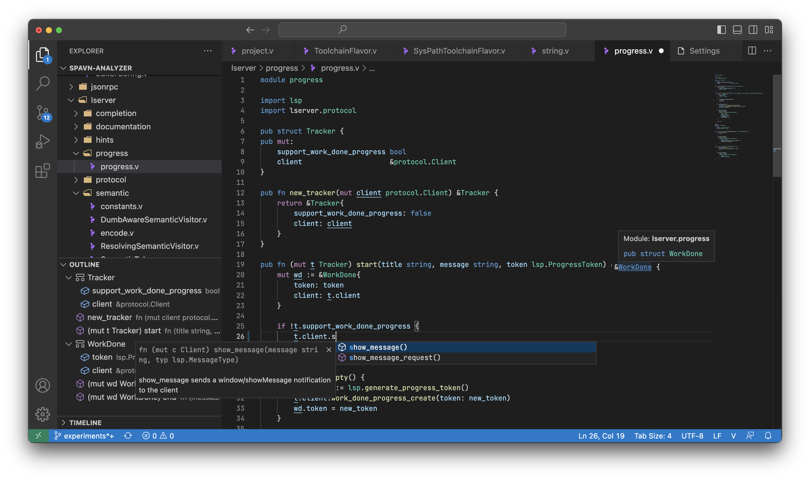

# v-analyzer support for Visual Studio Code



## Features

- code completion
- go to definition, type definition
- find all references, document symbol, symbol renaming
- types and documentation on hover
- inlay hints for types and some construction like `or` block
- semantic syntax highlighting
- formatting
- signature help

## Manual installation

1. Open the command palette with `Ctrl+Shift+P` or `Cmd+Shift+P`
2. Type `Install from VSIX...` and hit enter
3. Select pre-built VSIX file from this folder or build it yourself

## Building from source

```bash
npm run package
```

## License

This project is under the **MIT License**.
See the
[LICENSE](https://github.com/vlang-association/v-analyzer/editors/blob/master/LICENSE)
file for the full license text.
